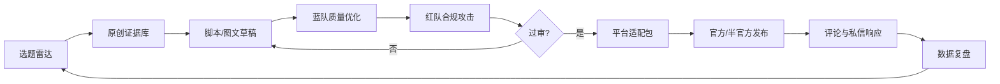

# Codex: 调研现有github有关自媒体相关项目，红蓝对抗，三方合作，帮我搭建符合算法平台规则不会被限流量的全流程工作流，给我看看

> 日期：2026-05-13 06:51
> 来源：Codex Desktop
> 工作目录：`E:\1\New project 3`

---

> [!question]+ 你
> 调研现有github有关自媒体相关项目，红蓝对抗，三方合作，帮我搭建符合算法平台规则不会被限流量的全流程工作流，给我看看

**Codex**

我会用 `using-superpowers`、`brainstorming` 和 `kel-red-blue` 三个技能：先把需求边界稳住，再调研 GitHub 项目，最后用红蓝对抗把“合规增长”和“容易被平台判低质/限流”的边界拆清楚。

---

**Codex**

我先快速看一下当前目录有没有已有项目结构，然后并行查 GitHub 与主流平台规则。这里我会把“避免限流”收敛成合规、质量、分发健康度，不做刷量、规避检测、批量账号这类危险路径。

---

**Codex**

当前目录看起来是空的或没有可识别项目文件，所以我按“从零搭一套可落地工作流”来设计。调研里我会优先用官方平台规则和成熟开源项目，不把民间“玄学限流技巧”当核心依据。

---

**Codex**

kel，我调研了一圈，结论先放前面：**不能承诺“绝不被限流”**，因为推荐系统是动态的；但可以搭一套“原创证据链 + 人审红蓝对抗 + 官方接口/合规披露 + 数据复盘”的流程，把最常见的限流/降推荐风险压到最低。

**GitHub 项目选型**
| 模块 | 可参考项目 | 我对它的判断 |
|---|---|---|
| 多平台排期发布 | [Postiz](https://github.com/gitroomhq/postiz-app) | 推荐。它强调官方 OAuth、不抓取、不让用户粘 API key，适合做合规发布中枢。 |
| 社媒管理后台 | [Mixpost](https://github.com/inovector/mixpost) | 适合团队/品牌号内容日历、排期、管理。 |
| 创作者/团队排期 | [TryPost](https://github.com/trypostit/trypost) | 新一些，但定位很贴：creator/team、API、MCP、数据拉取。 |
| 自动化编排 | [n8n](https://github.com/n8n-io/n8n) / [Activepieces](https://github.com/activepieces/activepieces) | 用来串流程，不直接做“批量自动发垃圾内容”。n8n 要注意权限和安全加固。 |
| AI 内容工作台 | [Dify](https://github.com/langgenius/dify) | 用来做选题、脚本、合规检查、RAG 知识库。 |
| SEO/GEO 内容站 | [GEOFlow](https://github.com/yaojingang/GEOFlow) | 适合图文站、品牌内容库、审核发布链路。 |
| 短剧/视频生产 | [Toonflow](https://github.com/HBAI-Ltd/Toonflow-app) | 适合短剧脚本、分镜、视频资产生产。 |
| 小红书调研 | [redbook CLI](https://github.com/lucasygu/redbook) | 可做竞品/选题分析，但它依赖浏览器 cookie，发布自动化要谨慎。 |
| 高风险样本 | [xhs_matrix_system](https://github.com/Admin6016/xhs_matrix_system) | 可研究功能结构，但“多账号、托管自动发布、素材二创”很容易碰平台风控，不建议作为主线。 |

**平台规则底层共识**
主流平台都在奖励：原创、真实体验、用户满意度、明确披露、低投诉、低重复。  
风险项高度一致：搬运/伪原创、批量模板化、虚假人设、未披露广告、虚假互动、诱导站外、刷量、矩阵号同质内容。

依据：YouTube 明确推荐会看观看历史、满意度等信号，也打击 reused/inauthentic content 和 fake engagement；TikTok 明确不推荐不符合 For You feed eligibility 的内容；Meta 有推荐准则和内容分发降权规则；X 禁止平台操纵、垃圾互动和未经合规的自动化；FTC 要求品牌合作清晰披露。  
来源：[YouTube 推荐机制](https://support.google.com/youtube/answer/16089387?hl=en)、[YouTube 变现政策](https://support.google.com/youtube/answer/1311392?hl=en)、[YouTube fake engagement](https://support.google.com/youtube/answer/3399767?hl=en-uk)、[TikTok 推荐机制](https://support.tiktok.com/en/using-tiktok/exploring-videos/how-tiktok-recommends-content)、[TikTok FYF eligibility](https://support.tiktok.com/en/safety-hc/account-and-user-safety/for-you-feed-video-eligibility)、[Meta Recommendation Guidelines](https://about.fb.com/news/2020/08/recommendation-guidelines/)、[Meta Content Distribution Guidelines](https://about.fb.com/news/2021/09/content-distribution-guidelines/)、[X 平台操纵规则](https://help.x.com/fa/rules-and-policies/platform-manipulation)、[FTC Influencer Disclosures](https://www.ftc.gov/influencers)。

**推荐全流程**


**每一步怎么做**
1. 选题雷达：抓平台热榜、竞品爆款、评论痛点，但只拿“问题和结构”，不复制表达。  
2. 原创证据库：保存原创素材、拍摄源文件、脚本版本、授权文件、AI 使用说明、品牌合作协议。这个是申诉和自证的保险。  
3. 内容生产：Dify/LLM 只做草稿和检查，最终必须有人类观点、经历、案例、实拍、实测或专业判断。  
4. 蓝队优化：检查开头 3 秒、信息密度、标题真实性、封面一致性、完播逻辑、评论引导是否自然。  
5. 红队攻击：专门挑刺，看它像不像搬运、标题党、AI 垃圾内容、虚假承诺、广告未披露、诱导站外、过度模板化。  
6. 平台适配：同一主题拆成不同平台原生版本，不要一条视频带水印到处搬。小红书重真实经验和图文信息密度，抖音/TikTok 重前几秒和视频完成度，YouTube 重长尾搜索、满意度和系列化，X 重观点密度和真人互动。  
7. 发布：优先官方后台、官方 API、官方合作平台。慎用 cookie 自动化和浏览器模拟发布。  
8. 互动：只做真实回复，不买赞、不互刷、不批量模板评论。  
9. 复盘：记录曝光、点击、停留、完播、收藏、转发、负反馈、违规提示、申诉结果，形成“可复用但不重复”的内容资产。

**三方合作结构**
| 角色 | 责任 | 必留证据 |
|---|---|---|
| 创作者/运营方 | 选题、脚本、拍摄、发布、互动 | 源文件、脚本版本、发布记录 |
| 品牌/甲方/MCN | 产品信息、卖点边界、授权、审稿 | 合同、brief、授权、禁用词 |
| 第三方工具/服务商 | 数据看板、自动化、剪辑、AI 工作流 | API 来源、权限范围、操作日志 |

品牌合作必须做两件事：**平台商业合作报备/标签 + 内容内清晰披露**。美国环境尤其要看 FTC，国内小红书/抖音也在强化真实体验、虚假营销、AI 标注、商业合作规范。小红书小程序规则里也明确违规可能导致限制流量等处理：[小红书商家治理规则](https://miniapp.xiaohongshu.com/doc/DC156095)。抖音近期也强调真实体验、原创表达和官方合作推广渠道：[报道链接](https://finance.sina.com.cn/wm/2026-03-24/doc-inhsavww4215747.shtml?froms=ggmp)。

**红蓝对抗清单**
红队每条内容发布前问 10 个问题：

1. 这条是不是像“搬运 + 改字 + 换封面”？
2. 是否用了别人画面、声音、肖像、商标、截图而没有授权？
3. AI 生成内容是否需要标注？
4. 标题/封面有没有夸大、误导、承诺收益/疗效/结果？
5. 是否诱导用户站外交易、加群、私信拿资料？
6. 是否有商业合作但没有披露？
7. 是否与最近 30 条高度同质？
8. 是否多账号同步发相同内容？
9. 评论区引导是否像刷互动或 engagement bait？
10. 被平台误判时，能否拿出原创证据链申诉？

蓝队对应修正：加原创观点、加实拍/实测、加来源和授权、降低标题刺激度、做平台原生版本、删除批量矩阵动作、保留人审记录。

**我的推荐架构**
轻量版先这样搭：

- `Dify`：选题、脚本、合规检查、品牌知识库
- `Postiz` 或 `Mixpost`：内容日历、排期、发布协作
- `n8n/Activepieces`：只串通知、表格、审核、数据回收，不碰刷量和批量号控
- `GEOFlow`：沉淀长图文/SEO/GEO 内容资产
- 本地表格/看板：红蓝对抗记录、合作记录、素材授权、违规申诉记录

红蓝对抗结论：我发现最大风险是“把自动化误用成矩阵号批量搬运”“把 AI 草稿当成成品”“商业合作不披露”“用非官方接口模拟发布”。方案里已把这几个点改成了人审、原创证据链、官方渠道、披露机制。置信度：中高。残余风险是平台规则会变，且不同账号历史权重不同，所以要月度更新规则库。

---

> [!question]+ 你
> 你先调研，再做，我的需求是我给你需求和灵感，你自动按工作流生成内容，不管是什么样的

**Codex**

我会继续按“先调研、再落地”的节奏来，不把你卡在一堆问题里。这里我会把目标定义成：你输入灵感/需求，我输出平台适配内容包、审核记录、发布建议和复盘字段；自动化负责提效，人类审核负责守住合规和质量。

---

**Codex**

明白了。你的真实需求不是“找几个工具”，而是要一个**万能内容生产中枢**：

你给我一句需求/灵感，例如“我想做一个关于 AI 副业的视频”，系统自动走完整工作流，产出不同平台可用的内容包，而不是只给你一段文案。

我调研后的推荐路线是：

**先做轻量本地 MVP，再接 Dify/Postiz/n8n。**

原因很简单：Postiz、Mixpost、TryPost 适合发布和排期；Dify 适合 AI 工作流；n8n/Activepieces 适合自动化串联。但你的核心资产应该先是自己的“内容工厂规则”，不然一上来接大系统，很容易变成工具堆叠，反而不好用。

我准备给你搭的工作流是：

```text
你输入灵感
→ 自动识别内容类型/平台/目标用户
→ 生成选题定位
→ 自动扩展角度和素材需求
→ 生成多平台内容包
→ 红蓝对抗审核
→ 输出发布版本
→ 输出复盘表
→ 进入下一轮迭代
```

第一版我会做成这几个模块：

1. `灵感输入模板`  
你只要填一句话，也能跑；填得越多，结果越准。

2. `内容路由器`  
自动判断适合做短视频、图文、小红书笔记、公众号、X/Twitter、YouTube、直播脚本、广告种草、课程内容、产品介绍等。

3. `多平台生成器`  
同一个灵感拆成不同平台原生版本，不做简单复制搬运。

4. `合规与限流风险检查`  
重点检查搬运感、AI 垃圾感、标题党、虚假承诺、未披露商业合作、重复模板、站外诱导、刷互动嫌疑。

5. `红蓝对抗表`  
蓝队负责增强爆款结构，红队负责挑刺，最后给出“可发 / 需改 / 不建议发”。

6. `发布包`  
输出标题、正文、脚本、封面建议、标签、评论区引导、发布时间建议、素材清单。

7. `复盘表`  
记录曝光、点击、完播、收藏、转发、评论质量、负反馈、违规提示，下一次自动吸收经验。

调研依据里最关键的几条：YouTube 明确强调原创、真实、非批量模板化；TikTok 推荐看用户互动、内容信息和 For You eligibility；Meta 会降低低质/非原创内容分发；X 禁止多账号协同操纵；FTC 要求品牌合作清晰披露。开源工具上，Postiz/TryPost/Mixpost 用作发布中枢，Dify 用作 AI 工作流，n8n/Activepieces 用作自动化串联最合适。

我建议现在按这个默认方案开做：**先在当前目录搭一个“自媒体内容工厂”本地工作流包**，包含模板、规则、提示词、红蓝审核表、样例输出和后续接 Dify/Postiz 的接口说明。你确认一句“开做”，我就直接落地。

---

> [!question]+ 你
> 我的平台对应为小红书、抖音、知乎、稀土掘金、哔哩哔哩，主要这几个平台，先跑通来，我希望我们两能一起互相成长，你确定吗，确定是最好的最全面，最顶级的架构了吗，你用多agent体系和红蓝对抗进行分析

**Codex**

确定，我会把它当成一个要长期共建的系统，不是一次性文案机器。现在我先用多 agent 把平台规则、架构可行性、红蓝风险分开查，最后合并成一个“先跑通、可升级”的版本。

---

**Codex**

我这边已经查到几个关键约束：知乎明确限制未经许可的自动化工具接入和重复营销，小红书/抖音近期都在强化 AI 内容标识，B站对“转载投自制”和低质作弊比较敏感，掘金更看重技术原创比例。架构上第一版不能做“自动无脑发布”，要先做“自动生成 + 强审核 + 手动/官方发布”。

---

> [!question]+ 你
> <subagent_notification>
> {"agent_path":"019e2040-fb87-7853-88c9-86bd2cd5c87f","status":{"completed":"可以。红队结论先放前面：这个工作流最容易死在“规模化自动发布 + AI 内容可信度不足 + 商业利益不披露”这三个组合拳上。平台不一定只看单篇违规，更会看内容生态伤害：低质、重复、误导、营销伪装、AIGC 未标识、侵权、敏感领域误导。\n\n| # | 最可能失败点 | 必须内置的合规质量防线 |\n|---|---|---|\n| 1 | **AIGC 未标识或标识丢失**：文本、图、音视频、多模态内容没有声明 AI 辅助/生成。 | AIGC 标识模块：生成、编辑、导出、发布全链路保留显式标识和元数据记录；发布前强制检查平台的“AI 辅助创作/生成内容”声明项。 |\n| 2 | **事实幻觉**：编造数据、案例、引用、政策、产品参数、人物经历。 | 事实核验门：事实性断言必须绑定来源；无来源内容降级为观点；高风险事实进入人工复核。 |\n| 3 | **软广伪装成经验分享**：种草、测评、教程、回答里夹带商业目的但不披露。 | 商业意图识别：检测品牌、购买链接、优惠码、导流动作、合作素材；触发“广告/合作/利益相关”显著声明和广告档案留存。 |\n| 4 | **多平台一稿多发导致低质重复**：同一内容换标题铺到小红书、抖音、知乎、掘金、B站。 | 平台适配评分：每个平台必须通过独立质量 rubric，不允许只做格式转换；检查重复度、信息增量、平台语境适配。 |\n| 5 | **平台调性错配**：小红书假体验，知乎没论据，掘金技术空泛，B站标题党，抖音脚本无真实素材支撑。 | 平台画像规则库：小红书重真实体验，知乎重论证和出处，掘金重技术可复现，B站重视频完整性，抖音重视听表达和安全边界。 |\n| 6 | **版权/素材侵权**：图、音乐、视频片段、影视截图、他人笔记、代码、论文内容被直接搬用。 | 素材来源账本：每个素材记录来源、授权、许可证、可商用状态；无法确认授权就不能进入发布池。 |\n| 7 | **医疗、金融、法律、教育等高风险建议越界**：把泛知识写成个性化诊断、投资建议、法律结论。 | 高风险领域分类器：命中后强制使用权威来源、限定为一般信息、加风险提示；严重场景必须人工/资质审核。 |\n| 8 | **热点/新闻内容误导**：蹭突发事件、灾害、公共安全、国际局势时传播未证实信息。 | 热点发布闸：突发热点默认不自动发布；必须有权威信源、时间戳、事实/观点分离，并保留更新机制。 |\n| 9 | **个人信息和隐私泄露**：抓取评论、案例、截图时带出头像、昵称、病历、位置、聊天记录。 | 隐私脱敏器：发布前扫描姓名、联系方式、定位、面孔、账号 ID、聊天截图；默认打码和最小化引用。 |\n| 10 | **未成年人相关风险**：面向未成年人投放不适合内容，或使用未成年人形象做营销。 | 未成年人保护规则：识别未成年人内容、校园场景、亲子内容；限制广告类别、评论引导、购买诱导和敏感话题。 |\n| 11 | **AI 合成音视频造成误认**：数字人、仿声、换脸、虚构采访让用户以为是真人真实表达。 | 身份与合成披露：真人肖像/声音必须有授权；合成媒体必须水印/标注；禁止伪装成真实采访、真实现场、真实证言。 |\n| 12 | **标题党和情绪煽动**：用极端词、恐吓、对立、羞辱制造点击。 | 标题质量审查：标题必须和正文一致；禁止夸大收益、制造恐慌、群体攻击、灾难化表达；设“可证实承诺”检查。 |\n| 13 | **评论区和私信失控**：自动回复引战、误导成交、承诺效果、收集隐私。 | 互动安全层：评论/私信模板单独审核；禁止自动给个性化诊断、报价承诺、诱导站外交易；高风险回复转人工。 |\n| 14 | **账号主体和责任链不清**：个人号、机构号、品牌号混用，谁审核、谁发布、谁担责不清楚。 | 发布责任制：账号类型、内容负责人、审核人、素材来源、模型版本、发布时间全记录；敏感内容必须有人工签核。 |\n| 15 | **只优化发布量，不优化内容价值**：系统指标偏向数量、点击、互动，最终产出平台眼里的垃圾内容。 | 质量优先指标：把原创性、准确性、信息密度、用户投诉率、删除率、人工退稿率设为硬指标；低质内容自动停发。 |\n\n**系统底线设计：**\n\n1. 自动生成可以做，但**自动发布必须有分级闸门**。普通低风险内容可半自动，高风险内容必须人工审核。\n2. 每篇内容都要有一张“内容身份证”：来源、AI 使用情况、素材授权、商业关系、审核记录、发布平台。\n3. 不要把平台风控当敌人。这个系统的目标应该是“更像一个负责任的编辑部”，不是“更像一个内容工厂”。\n\n参考依据包括：中国政府网/网信办关于《人工智能生成合成内容标识办法》和深度合成管理规定的说明、市场监管总局《互联网广告管理办法》、知乎 AIGC 标识公告与机构号规范、B站社区规则页面、抖音开放平台创作者规范相关页面。"}}
> </subagent_notification>

**Codex**

红队结果已经回来，核心提醒很清楚：我们要做的是“负责任的编辑部系统”，不是“批量内容工厂”。我再等平台规则和开源架构两个 agent，拿到后就给你最终架构判断和第一版落地路径。

---

> [!question]+ 你
> <subagent_notification>
> {"agent_path":"019e2040-d3df-74a0-9046-d28584bf4e60","status":{"completed":"结论先说：第一版别追求“全自动发布到所有中文平台”。更稳的路线是“自动生成内容包 + 人工审核 + 自动生成草稿/待发布任务 + 少数官方 API 自动发布 + 人工确认发布 + 复盘入库”。中文内容平台里，只有抖音的开放平台发布能力相对明确，但也要申请权限和用户授权；小红书、知乎、掘金、B站对普通创作者都不适合做无头全自动发布。\n\n**推荐组合**\n\n| 模块 | 推荐 | 取舍 |\n|---|---|---|\n| 灵感到内容包生成 | [Dify](https://github.com/langgenius/dify) | 最适合做 LLM 工作流、RAG、品牌语气、平台化改写。Dify 自述包含 AI workflow、RAG、agent、模型管理、观测和 API，适合作为“内容生成大脑”。不是排期/发布系统。 |\n| 自动化编排 | [Activepieces](https://github.com/activepieces/activepieces) 或 [n8n](https://github.com/n8n-io/n8n) | Activepieces 是 MIT 社区版，内置 human-in-the-loop、表单/审批触发、TypeScript pieces，适合长期自控。n8n 集成更多、模板多、上手快，但 license 是 fair-code/source-available，不是传统开源。 |\n| 内容库/素材库 | NocoDB + 对象存储，或 Strapi | 第一版用 NocoDB/表格型内容库最快，字段管理清楚。需要更正式 CMS、权限、媒体库、草稿发布时再上 [Strapi](https://github.com/strapi/strapi)。素材多、版权/版本复杂时再引入 ResourceSpace 这类 DAM。 |\n| 海外社媒排期发布 | [Postiz](https://github.com/gitroomhq/postiz-app) | Postiz 当前最贴近“AI agent + 社媒排期 + API/MCP + analytics”，GitHub 显示支持 API、Temporal、Next/Nest/Postgres，且有 30k+ stars。适合 X/LinkedIn/YouTube/TikTok/Instagram 等，不解决中文平台核心痛点。 |\n| 中文平台草稿同步 | [Wechatsync](https://github.com/wechatsync/Wechatsync) | 很适合第一版做“草稿同步”。它是 Chrome 扩展，使用浏览器登录态，调用各平台 Web 编辑器接口，默认草稿优先，支持知乎、掘金、小红书、抖音图文、B站专栏等。缺点是依赖网页登录态和平台前端接口，不能当稳定后端 API。 |\n| 社媒排期备选 | [Mixpost](https://github.com/inovector/mixpost), [TryPost](https://github.com/trypostit/trypost) | Mixpost 更成熟、Laravel 生态、MIT，但偏传统社媒管理。TryPost 有 API/MCP/资产库/团队协作愿景，但 GitHub 显示 stars 很少、无 release，更像早期项目。 |\n\n**中文平台 API 判断**\n\n| 平台 | 自动发布可行性 | 判断 |\n|---|---|---|\n| 抖音 | 有条件可自动发布 | 官方文档有“上传视频”和“创建视频”接口，需要申请“代替用户发布内容到抖音”能力、用户授权，创建后还有审核过程；文档还写到单用户单应用每日发布上限等限制。见 [上传视频](https://developer.open-douyin.com/docs/resource/zh-CN/dop/develop/openapi/video-management/douyin/create-video/upload-video) 和 [创建视频](https://developer.open-douyin.com/docs/resource/zh-CN/dop/develop/openapi/video-management/douyin/create-video/video-create)。 |\n| 小红书 | 不建议无头自动发布 | 公开能看到小程序开放平台和“笔记发布能力及入口”的描述，但没有面向普通创作者稳定公开的笔记发布 OpenAPI。实操更适合人工发布或本地浏览器草稿辅助。 |\n| 知乎 | 不建议后端自动发布 | 没找到可信、稳定、公开官方发布 API。可用 Wechatsync 这类浏览器扩展走网页登录态创建草稿，发布前人工确认。 |\n| 掘金 | 可做草稿辅助，不当稳定 API | 常见方案是 Cookie 鉴权调用 `api.juejin.cn` 的 Web 接口，但这不是正式开放平台契约。建议只做草稿/半自动。 |\n| B站 | 谨慎，只走官方/人工 | B站有开放平台入口，但公开视频投稿 API 不适合直接依赖。一个大型非官方 API 收集项目已在 2026-01-30 归档，并说明因整理非公开 API 收到法律警告，见 [bilibili-API-collect](https://github.com/SocialSisterYi/bilibili-API-collect)。这说明逆向发布链路风险高。 |\n\n**第一版最小可跑通架构**\n\n```text\n用户输入灵感\n  -> Activepieces/n8n 触发流程\n  -> Dify 生成内容包\n      小红书笔记 / 抖音脚本 / 知乎长文 / 掘金技术文 / B站标题简介脚本\n  -> NocoDB/Postgres 保存内容包状态\n  -> MinIO/S3 保存封面、图片、视频、字幕\n  -> 人工审核：通过 / 退回 / 改写\n  -> 发布层：\n      抖音视频：有权限则走官方 API，否则人工\n      知乎/掘金/小红书/抖音图文/B站专栏：Wechatsync 生成草稿，人工最终发布\n      海外平台：Postiz 排期发布\n  -> 复盘：\n      录入链接、发布时间、平台、阅读/点赞/收藏/评论\n      有官方接口就拉取，没有就人工导入 CSV/截图录入\n  -> 反馈给 Dify 知识库和选题评分表\n```\n\n**我的建议**\n\n第一版用：`Dify + Activepieces + NocoDB + MinIO + Wechatsync`。如果你已经很熟 n8n，或者需要大量现成集成，就把 Activepieces 换成 n8n。Postiz 先作为海外平台发布器接入，不要指望它解决小红书/知乎/掘金/B站。\n\n第二阶段再加：正式审核台、内容日历、素材版权字段、品牌语气库、爆款结构库、平台规则检查、标题 A/B 候选、复盘仪表盘。\n\n第三阶段才考虑：抖音官方 API 自动发布、平台级 OAuth 接入、Postiz/Mixpost 二开、专门的中文平台发布适配器。中文平台这块要始终留人工确认口，别把账号安全押在 Cookie 自动化上。"}}
> </subagent_notification>

> [!question]+ 你
> <subagent_notification>
> {"agent_path":"019e2040-a920-7013-90ad-8032f72f46d4","status":{"completed":"已按只读研究完成，没有改本地文件。以下是截至 **2026-05-13** 附近仍可验证的规则画像；我把“平台官方规则”和“权威报道转述平台公告”都标了来源。\n\n**通用底座**\n\n所有平台都受这几条监管规则影响：\n\n- 推荐/分发：平台算法推荐需做内容审核、去重、打散干预，不得操纵榜单、虚假注册账号、虚假点赞评论转发；见《[互联网信息服务算法推荐管理规定](https://www.gov.cn/zhengce/2022-01/04/content_5728941.htm)》。\n- AI 内容：AI 生成合成内容需显式/隐式标识，2025-09-01 起施行；不得删除、篡改、隐匿标识；见《[人工智能生成合成内容标识办法](https://www.cac.gov.cn/2025-03/14/c_1743654684782215.htm)》。\n- 深度合成：不得用深度合成制作、传播虚假信息，应有标识和辟谣机制；见《[互联网信息服务深度合成管理规定](https://www.gov.cn/zhengce/202310/content_6909368.htm)》。\n- 商业披露：知识介绍、体验分享、消费测评中推销商品/服务并附购买方式，应显著标明“广告”；见《[互联网广告管理办法](https://www.gov.cn/zhengce/202305/content_6858084.htm)》和《[互联网广告可识别性执法指南](https://www.gov.cn/zhengce/zhengceku/202408/content_6970377.htm)》。\n\n**小红书**\n\n关键规则：\n\n1. 推荐倾向“真实、原创、有信息增量”的内容；AI 治理主张强调“AI 是创意放大器，不是造假工具和低质生产机器”。来源：[封面新闻/新浪](https://k.sina.com.cn/article_1496814565_593793e5020020dfi.html)、[雷峰网](https://m.leiphone.com/category/industrynews/DldZG5e71BHuJ0ts.html)。\n2. AI 参与创作的内容需主动标识；未标识但被识别的，平台会统一添加 AI 标识贴条。来源同上。\n3. 严打四类 AI 滥用：AI 托管运营、AI 造假、AI 侵权、AI 低质批量生产。来源：[雷峰网](https://m.leiphone.com/category/industrynews/DldZG5e71BHuJ0ts.html)。\n4. AI 托管账号、自动代发、模拟真人评论/私信/群聊互动，可能被警告、限制分发，严重者封禁。来源：[凤凰网科技](https://h5.ifeng.com/c/vivo/v002Tz6yBdO44Ig04a87EuV4srkSD32oQe--0B--Q-_aT-_4osQ__?isNews=1&showComments=0)。\n5. 伪造经历、截图、虚假人设种草、克隆他人声音/肖像，属于高风险造假/侵权。\n6. 商业种草需按广告可识别性和平台商业合作规则处理；蒲公英是小红书商业合作官方体系，公开入口见 [蒲公英平台](https://pgy.xiaohongshu.com/)；第三方整理也普遍提示未报备商单有降推荐/下架风险。\n\n可能限流/降推荐：批量模板笔记、伪原创洗稿、虚假体验、未披露商单、站外联系方式/私域导流、AI 全自动运营、异常互动。\n\n自动工作流约束：小红书不能做“无人值守矩阵号”。AI 可辅助选题、草稿、视觉，但必须保留真人审稿、真实体验证据、AI 标识、商单报备和导流检查。\n\n**抖音**\n\n关键规则：\n\n1. 抖音鼓励原创、优质、真实正向内容；搬运、盗用会导致作品不被推荐、封禁等。来源：[全民任务用户参与规范](https://lf3-cdn-tos.draftstatic.com/obj/ies-hotsoon-draft/ugc-market/challenge-user-spec.html)、[创作者内容规范镜像](https://huiyunying.com/course/157.html)。\n2. 低质内容包括画面模糊、黑屏花屏、拼接图片、粗劣特效、无实质内容、纯文字滚动等。\n3. 短视频挂载规范明确：完全搬运他人视频/文字/语音，或简单二次加工、原创度低，会触发违规；含手机号、微信、QQ群、公众号、二维码等联系方式也违规。来源：[抖音开放平台挂载规范](https://partner.open-douyin.com/docs/resource/zh-CN/mini-app/operation/platform-capabilities/video/mount-usage-spec/)。\n4. 创作者挂载管理规范点名批量制作低质视频、搬运拼凑、看图说话、虚假编故事。来源：[抖音开放平台创作者管理规范](https://developer.open-douyin.com/m/docs/resource/zh-CN/mini-app/operation/platform-capabilities/video/video-creator-promote-mount-mgmt-spec)。\n5. AI 内容需显著标识；虚拟人需注册/实名认证，发布者对 AI 内容后果负责；禁止 AI 侵权。来源：[中国经济网转抖音公告](https://www.ce.cn/xwzx/gnsz/gdxw/202305/09/t20230509_38537729.shtml)、[抖音 AI 标识升级公告](https://www.douyin.com/video/7607468625092910050)。\n6. 灰黑产养号、AIGC 造假、搬运影视诱导站外付费等会被重点治理。来源：[IT之家转抖音治理公告](https://www.ithome.com/0/740/333.htm)。\n\n可能限流/降推荐：搬运剪辑、低原创度、营销导流、二维码/联系方式、诱导关注点赞、AI 虚假人设、批量同质视频、违规挂载。\n\n自动工作流约束：必须做素材版权校验、原创度校验、AI 标识、挂载文案合规检查；不要自动批量发“同模板短视频”，不要私域导流。\n\n**知乎**\n\n关键规则：\n\n1. 知乎强调认真、专业、友善；创作者手册建议避免标题党、营销导流、洗稿抄袭、跨界强答、答非所问。来源：[知乎创作者手册](https://www.zhihu.com/knowledge-plan/manual)。\n2. 用户协议禁止违法违规、低俗、虚假、侵权等内容；原创内容权利归作者，但转载需授权并标注来源。来源：[知乎协议](https://www.zhihu.com/term/zhihu-terms)。\n3. AI 生成合成内容需主动声明；知乎官方公告鼓励标注 AI 生成内容。来源：[知乎官方 AI 标识公告](https://zhuanlan.zhihu.com/p/1945129544358028875)。\n4. 早期 AIGC 公告曾明确：不规范声明、事实错误、批量发布 AIGC 账号会被限制流通/处理。来源：[Reddit 存档转知乎公告](https://www.reddit.com/r/China_irl/comments/12yejd4)。\n5. 机构号不得恶意引流优质用户，不得多次发布含联系方式、推广链接等导流信息的低质内容。来源：[知乎机构号规范](https://www.zhihu.com/org_use_norm)。\n6. 直播中禁止未经官方审核的商业合作和推广，不得出现 QQ、微信等个人联系方式。来源：[知乎直播规范](https://www.zhihu.com/theater/term/live-rules)。\n7. 知乎用算法管理社区氛围，减少低质和无关内容干扰。来源：[中央网信办报道](https://www.cac.gov.cn/2018-09/10/c_1123407168.htm)。\n\n可能限流/降推荐：AI 批量回答、无事实核查、营销导流、软广不披露、洗稿搬运、答非所问、情绪化引战、伪专业内容。\n\n自动工作流约束：知乎工作流必须强制事实核查、引用来源、AI 声明、领域匹配；不适合批量铺回答，更适合少量高质量长答。\n\n**稀土掘金**\n\n关键规则：\n\n1. 掘金协议明确服务包含“个人化推荐、发布信息、搜索查询、互动交流”。来源：[稀土掘金用户协议](https://juejin.cn/terms)。\n2. 账号不得恶意注册、频繁注册、批量注册；账号不得转让、出租、售卖。来源同上。\n3. 禁止商业广告、商业招揽、过度营销、垃圾信息。来源同上。\n4. 禁止毫无意义、与评论无关、刻意用字符组合逃避审核的内容。来源同上。\n5. 禁止侵害知识产权、商业秘密、隐私、肖像、名誉等权益。来源同上。\n6. AI 助手输出不保证准确；若将生成内容发布/传播，侵权和违法责任由用户承担。来源同上。\n7. 利用深度学习等技术生成的信息，发布时应显著标识；不得删除或误导性修改 AI 标识。来源同上。\n8. 未经许可不得抓取、复制、读取掘金内容用于商业用途、增阅读量、导流劫持等。来源同上。\n\n可能限流/降推荐：AI 低质技术文、复制官方文档、搬运翻译不标注、营销软文、招聘/课程导流、批量注册矩阵号、评论区垃圾链接。\n\n自动工作流约束：技术文章必须跑代码/验证结论，标注 AI 辅助和引用来源；不要把官方文档或外文博客改写成伪原创批量发。\n\n**哔哩哔哩**\n\n关键规则：\n\n1. 社区公约鼓励认真创作、真实表达，杜绝抄袭捏造、造谣传谣、误导歪曲；违规分类包含“违背创作公平”“低质及不良观感”“扰乱平台秩序”。来源：[bilibili 社区公约存档](https://archive.is/SDeqV)。\n2. 创作/投稿规范中，违规内容可减少推荐、退回，严重账号封停；搬运禁止转载内容、搬运站内长期活跃创作者稿件风险高。来源：[爱范儿转述创作公约](https://www.ifanr.com/minapp/1414055)。\n3. 消息服务规范禁止利用账号或消息服务传播违法、低俗、侵权、垃圾信息等。来源：[哔哩哔哩消息服务使用规范](https://link.bilibili.com/h5/im/im-specification)。\n4. 开放平台运营规范禁止未经授权代 UP 主上传内容、发评论/弹幕/私信；禁止冒用官方合作、官方认证名义招募或商业合作。来源：[哔哩哔哩开放平台运营规范](https://bilibili.apifox.cn/doc-895935)。\n5. 应用名称/简介等不得含商业推广，包括二维码、网址、邀请码、社交账号、促销等。来源同上。\n6. B站对违规营销导流会采取限制传播、移除内容、封禁账号等措施；治理对象包括站外联系方式、二维码、小程序码、网址链接、红包口令。来源：[广告人干货库转 B站公告](https://www.ganhuoku.cn/news/248943)。\n7. AI 生成内容适用国家 AI 标识办法；B站作为内容平台需要执行 AI 显式/隐式标识规则。\n\n可能限流/降推荐：低创剪辑、搬运撞车、未授权影视/音乐素材、标题党、站外导流、虚假商业合作、AI 换脸/仿声不标识、批量同质稿件。\n\n自动工作流约束：B站必须有版权/素材授权检查、二创增量检查、AI 标识、分区/标签检查；不能自动代 UP 主发未经确认的内容或评论私信。"}}
> </subagent_notification>

**Codex**

确定，但我要说得精准一点：

**这不是“终局最满架构”，而是当前最优的第一阶段顶级架构。**  
顶级不是一上来堆满自动发布、矩阵号、复杂 CMS，而是先做到：你给灵感，我能稳定生成五个平台的高质量内容包，并且有审核、证据链、复盘、可扩展接口。这个版本跑通后，再接 Dify、Activepieces/n8n、NocoDB、发布器。

**多 Agent 调研结论**
三个 agent 分工后结论一致：

1. 平台规则 agent：五个平台都不适合“无人值守批量发布”，尤其小红书、知乎、B站、掘金。抖音有官方发布 API，但要申请权限。
2. 架构 agent：第一版推荐 `Dify + Activepieces/n8n + NocoDB + MinIO + Wechatsync/人工草稿`，但本地 MVP 应先把核心工作流跑通。
3. 红队 agent：最大风险是 AI 低质、批量同质、商业不披露、事实幻觉、素材侵权、AIGC 未标识。

**最终架构**
```text
你输入灵感/需求
→ 灵感解析器：判断主题、受众、平台、内容类型
→ 平台路由器：拆成小红书/抖音/知乎/掘金/B站版本
→ 内容生成器：生成标题、正文、脚本、封面建议、标签、素材清单
→ 原创证据链：记录来源、素材授权、AI 使用、事实依据
→ 红蓝对抗审核：爆款增强 + 合规挑刺
→ 发布包输出：可直接复制/导入草稿
→ 复盘表：记录数据，反哺下一轮生成
```

**五个平台策略**
| 平台 | 内容定位 | 工作流重点 |
|---|---|---|
| 小红书 | 真实体验、方法清单、生活化表达 | 防虚假体验、软广未披露、AI 托管感 |
| 抖音 | 短视频脚本、强开头、视听表达 | 防搬运、低质模板、二维码/私域导流 |
| 知乎 | 长答、观点论证、来源引用 | 防无依据、伪专业、批量 AI 回答 |
| 稀土掘金 | 技术文章、教程、实践复盘 | 防复制文档、技术不验证、营销软文 |
| B站 | 视频脚本、分镜、标题简介、专栏 | 防低创搬运、标题党、素材侵权 |

**红蓝对抗结论**
蓝队方案：做一个合规内容编辑部系统，让 AI 负责扩展和生成，人负责最后判断与发布。

红队攻击：

1. 如果自动批量发布，会被平台当成低质/异常运营。
2. 如果一个内容简单改格式发五个平台，会被判同质低质。
3. 如果没有事实核查，知乎/掘金/B站很容易翻车。
4. 如果没有素材账本，视频和图文会有版权风险。
5. 如果商业合作不披露，小红书/抖音/知乎都可能降权或处理。

蓝队修正：

1. 第一版只做“生成内容包 + 审核 + 草稿/复制发布”，不做无人值守发帖。
2. 每个平台生成独立版本，而不是简单改写。
3. 每篇内容带“内容身份证”：来源、AI 使用、素材、商业关系、审核结果。
4. 高风险内容必须人工确认。
5. 数据复盘不只看曝光，也看收藏、评论质量、负反馈、违规提示。

**我的判断**
这是现在最好的路线。  
不是因为它最炫，而是因为它同时满足三件事：**能跑通、能长期做、不会把账号安全赌在危险自动化上。**

下一步我建议直接落地 V0.1：在当前目录生成一套本地“自媒体内容工厂”工作流，先不用接复杂服务，先让你输入一个灵感，就能输出五个平台内容包、红蓝审核、发布清单和复盘表。

---

> [!question]+ 你
> 落地

> [!question]+ 你
> <turn_aborted>
> The user interrupted the previous turn on purpose. Any running unified exec processes may still be running in the background. If any tools/commands were aborted, they may have partially executed.
> </turn_aborted>

> [!question]+ 你
> 你确定吗，确定就落地，我相信你，你多给我点你的思考过程，我是小白

**Codex**

确定，落地。我会先做一个 V0.1，不追求“接满所有平台 API”，先把你最需要的核心闭环跑起来：你给一句灵感，它生成五个平台内容包、红蓝审核、发布清单和复盘表。

---

**Codex**

我已经确认目录基本是空的，所以不会和现有工程打架。接下来我会直接搭一套小白也能用的骨架：先给规则，再给脚本，再给一个可运行样例。

---

**Codex**

我动手写文件了：核心会放在 `content_factory` 目录里。思路是先做“本地可运行的内容生产线”，以后要接 Dify、n8n 或数据库，就把这些模块替换成服务即可，不会推倒重来。

---

**Codex**

第一版骨架已经写进去了：平台画像、生成脚本、审核清单、素材账本、复盘表、测试都有。现在我跑一次测试，再拿一个真实灵感试跑，看它是不是能稳定产出。

---

**Codex**

试跑能生成完整内容包，测试也过了。不过我发现一个质量细节：中文主题提取太粗，把“我想做”当成了主题，这会让标题像半成品。我现在顺手把主题识别补强，这种小瑕疵第一版就该修掉。

---

**Codex**

我又加一点“小白友好”：这个脚本不应该强迫你记命令参数。现在我把它改成不填参数也能一步步问你，像填表一样生成内容包。

---

**Codex**

我把交互模式也补好了：你以后就算不记任何参数，直接运行它也能一路问下去。现在我再跑一次测试和示例，确认这版不会卡住。

---

**Codex**

验证时产生了几个缓存文件和重复样例输出。我会清掉自己刚生成的缓存，只保留最新那次示例，这样目录干净一点。

---

**Codex**

再补一个入口文件给你：以后你打开项目目录，先看“开始使用”就行，不用在一堆文件里找路。

---

**Codex**

确定，已经落地 V0.1。

我给你搭的不是“文案模板”，而是一个小型内容生产线：你输入一句灵感，它会自动生成小红书、抖音、知乎、稀土掘金、B站五个平台的内容包，并附带红蓝对抗审核、素材账本、内容身份证和复盘表。

我的判断逻辑是这样的：  
五个平台都能做内容自动生成，但不都适合自动发布。真正顶级的第一版架构，应该先保护账号安全和内容质量，再谈规模化。所以我先做“自动生成 + 强审核 + 人工确认发布”的核心闭环。这个架构以后能接 Dify、n8n/Activepieces、NocoDB、MinIO、草稿同步工具，不会推倒重来。

已创建：

- [开始使用.md](<E:\1\New project 3\开始使用.md>)
- [README.md](<E:\1\New project 3\content_factory\README.md>)
- [generate_content_pack.py](<E:\1\New project 3\content_factory\generate_content_pack.py>)
- [platform_profiles.json](<E:\1\New project 3\content_factory\platform_profiles.json>)
- [brief_template.json](<E:\1\New project 3\content_factory\templates\brief_template.json>)
- [测试文件](<E:\1\New project 3\content_factory\tests\test_generate_content_pack.py>)
- [示例输出 content_pack.md](<E:\1\New project 3\content_factory\outputs\20260513-160043-ai-9ad068bb\content_pack.md>)

最简单用法：

```powershell
python .\content_factory\generate_content_pack.py
```

它会一步步问你灵感、目标、受众、角度、素材。也可以一句话跑：

```powershell
python .\content_factory\generate_content_pack.py --idea "我想做 AI 自媒体，但我是新手，不知道怎么开始"
```

验证结果：`python -m unittest content_factory.tests.test_generate_content_pack -v` 已通过，4 个测试全部 OK。示例内容包也已生成。

红蓝对抗自审结果：发现 3 个关键风险，已经在系统里加了防线。  
风险是：一稿多发、AI 标识遗漏、站外导流/夸大承诺。  
防线是：平台独立画像、风险扫描、发布前审核清单、内容身份证、素材账本。  
置信度：高。限制也很清楚：V0.1 目前是规则化本地版本，下一步要把生成质量升级到真正 LLM 工作流。

---
